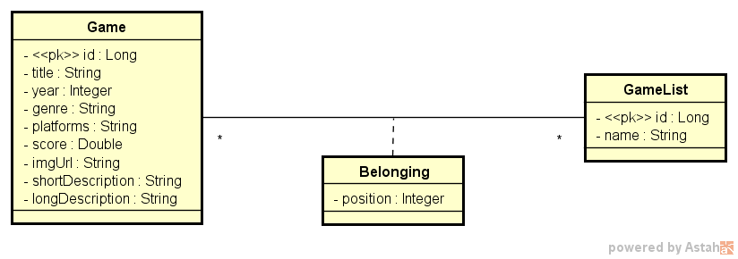
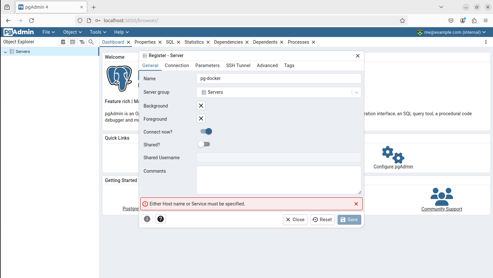
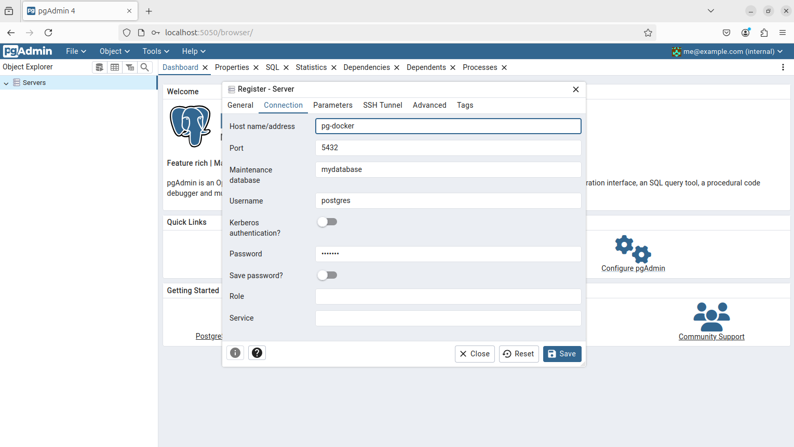

## Projeto de Lista de Jogos
Este projeto foi desenvolvido em um intensivão do canal [DevSuperior](https://www.youtube.com/@DevSuperior), no qual construí uma API utilizando padrões de projeto e boas práticas com Java Spring. 

### Requisitos para rodar o projeto
- **Java JDK** versão 21 ou superior
- **Maven** versão 3.9.9 ou superior

### Como rodar o projeto 
1. No terminal, clonar o projeto com o comando :
   ```git clone https://github.com/fael890/dslist.git```. 
   Se preferir, pode baixar o projeto compactado diretamente do repositório.

2. Após clonar, acesse a pasta do projeto no terminal e execute o seguinte comando:  
   ```mvn spring-boot:run```.
   
3. Depois de executar a API, acesse o endereço http://localhost:8080/swagger-ui/index.html no navegador, para visualizar a documentação feita com Swagger.

### Tecnologias utilizadas
- Java 
- Spring 
- Spring boot
- H2 (para ambiente de teste)
- PostgreSQL (para ambiente de homologação)
- Docker
- Postman
- Swagger

### Diagrama de classes



O diagrama de classes nos ajuda a compreender o domínio de negócio, representando as entidades, atributos e seus relacionamentos de forma clara. Essa estrutura serve como base para a construção do ORM com o JPA, que realiza o mapeamento das classes e relações para tabelas e colunas no banco de dados.

- A classe Game foi mapeada como uma tabela no banco de dados que armazena os dados dos jogos.
- A classe GameList foi mapeada como uma tabela no banco de dados que armazena as listas de jogos.
- O relacionamento entre as duas classes é feito por meio da entidade Belonging, que representa uma tabela intermediária entre Game e GameList, armazenando a posição dos jogos dentro das listas.

### Estrutura do projeto

Para manter boas práticas na organização do código, o projeto foi estruturado em diferentes pacotes:

- controllers: contém os controladores responsáveis por gerenciar as requisições feitas para a API.
- entities: armazena as classes do modelo de negócio, que são mapeadas como tabelas no banco de dados.
- services: contém as classes de serviço responsáveis por implementar as regras de negócio do sistema.
- repositories: camada responsável pelo acesso aos dados. Contém os repositórios do JPA, permitindo consultas personalizadas.
- DTO: armazena os Data Transfer Objects (DTOs), utilizados para selecionar dados específicos das entidades, aumentando a segurança e evitando a exposição direta dos modelos na API.
- projections: otimizam consultas personalizadas, tornando-as mais rápidas e permitindo encapsular determinados dados, assim como os DTOs.

### Perfis de projeto
No diretório **resources**, há perfis de configuração para diferentes ambientes:
- application-test: configuraçãoes para desenvolvimento/teste
- application-dev: configurações para homologação
- application-prod: configurações para produção

### API

| Método | Endpoint                         | Descrição                                            | Exemplo de Corpo (se aplicável)             |
|--------|----------------------------------|------------------------------------------------------|---------------------------------------------|
| GET    | `/games`                         | Retorna os dados mais relevantes de todos os jogos.  | -                                           |
| GET    | `/games/{gameId}`                | Retorna todos os dados do jogo com o ID especificado.| -                                           |
| GET    | `/lists`                         | Retorna todas as listas de jogos.                    | -                                           |
| GET    | `/lists/{gameListId}/games`      | Retorna todos os jogos de uma determinada lista.     | -                                           |
| POST   | `/lists/{gameListId}/replacement`| Troca a posição de um jogo na lista.                 | { "sourceIndex": 0, "destinationIndex": 4 } |

Caso queira mais detalhes da documentação, após executar o projeto acesse o endereço http://localhost:8080/swagger-ui/index.html

### Opcional: Ambiente de Homologação com Docker
Caso queira explorar mais o projeto, é possível configurar um ambiente de homologação (staging) com Docker. Para isso, siga os passos:

1. Após clonar o projeto, edite o arquivo **/src/main/resources/application.properties** e altere a linha:
   ```spring.profiles.active=${APP_PROFILE:test}```
   para
   ```spring.profiles.active=${APP_PROFILE:dev}```
   Isso faz com que o projeto utilize as configurações de homologação.

2. Na pasta raiz do projeto, execute: 
   ```docker compose up -d```
   Isso criará containers que formam um ambiente semelhante ao de produção.

3. Com os containers em execução, acesse o pgAdmin (http://localhost:5050) e faça login com as seguintes credenciais:
   - **E-mail:** ```me@example.com```
   - **Senha:** ```1234567```
  
4. Após acessar o pgAdmin, cadastre um novo servidor utilizando as credenciais conforme mostrado nas imagens abaixo:



A senha é: 1234567
É importante que sejam os mesmos dados da imagem, pois estão configurados no **docker-compose.yml**

6. Agora é possível testar o projeto no ambiente de homologação. Adicione dados no postgreSQL, para facilitar deixei um script com alguns dados aqui no diretório raiz do projeto ```/dslist/create.sql```

7. Agora basta executar a API normalmente com:
   ```mvn spring-boot:run```
   Dessa forma, os dados serão armazenados no PostgreSQL dentro do container, garantindo persistência mesmo que o container seja reiniciado.
